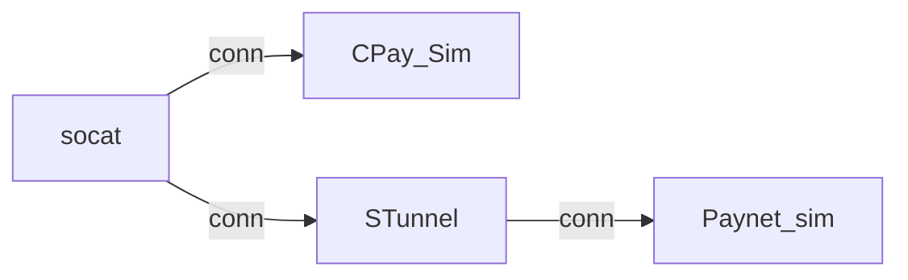

# Background

Paynet required GHL to become a client that connect to their server with TLS 1.2 prior Dec 2024.

# Methods

 A few methods discovered listed below some require host changes some does not require host changes.

## socat

This method does not requires host changes. The way it works is, this program able to act as client that connect to CPAY server (at the HostComm end) then act as client and make another connection to PayNet.

## change C++ code

This method requires a change to be made to the UAHostComm code where instead of listing, the HostComm must act as a client and connect to TLS 1.2

For this solution, No changes has been made to HostComm code yet, however I've made a simple C++ program that can connect to TLS 1.2.

The program name is test_socket which is a Visual C++ program.

# Test Methods

## Certificate Generation

Certificate is required in order to test TLS 1.2. Paynet required both client and server to supply certificate, so both client and server need to have a certificate.

To simplify from having to navigate the OpenSSL command, you can clone this repository to assist certificate generation.

```http
https://github.com/square/certstrap
```

Follow the repository readme.md, you should be able to generate your certificate in 5 minutes

## Generated Certificate

I've generate a certificate for my testing and I've included it in this repository inside **Certificates** directory.

If you use this certificate, you have to change the windows hostfile to map the certificate server domain name to the localhost ip as below:

```
127.0.0.1 zombieserver
```

## CPay and PayNet Simulator

I've created a sample program written in elixir that listen to 2 ports, 1 acting like a Cardpay and another one acting like Paynet. The one acting like a Cardpay is listening to a normal TCP socket, however the Paynet instances listening to a TLS socket.

All certificate, ca certificate and key is assigned at the Paynet listener supervisor as below:

```elixir
{PaynetServerAndCpayServerSim.PaynetServer.Listener,
          [port: 17502, verify: :verify_peer,
          keyfile: '..\\Certificates\\zombieserver.key',
          certfile: '..\\Certificates\\zombieserver.crt',
          cacertfile: '..\\Certificates\\Zombie_Spotters_Ltd.crt',
          password: '1234',
          secure_renegotiate: true,
          reuse_sessions: true
          ]}
```

To run the Simulator, just cd to the directory then key in this:

```elixir
iex -S mix
```

Then run netstat if it was listening to port 17501 and 17502. 17501 acting like a Cardpay server and the 17502 acting like a Paynet server.

## Test with Socat

Testing with socat is the simplest one, just download socat binary, copy into program files, then register the socat path.

Then to simplify the certificate path assignment to the socat command, just CD to the Certificates in this repository then type the command to connect the Cardpay and Paynet server.

```bash
socat TCP4:localhost:17501 SSL:zombieserver:17502,reuseaddr,cert=zombieclient.crt,cafile=Zombie_Spotters_Ltd.crt,key=zombieclient.key
```

What the command does is, it connect to localhost port 17501 with clear TCP then connect using SSL to server **zombieserver** port 17502 with the client certificate, ca certificate and the client certificate key.

## Test with C++ Program

Run the server simulator similar as when testing with socat, however for this case, port 17501 will not be used since the C++ program itself will connect to port 17502.

Just run the C++ program, it already configured with the certificate, ca certificate and key.

## Test the Simulator TLS with STunnel

To make sure the TLS 1.2 is configured correctly for the PayNet simulator. Its better to validate the Paynet Simulator by changing the Paynet Simulator to listening to a clear TCP socket, but run a STunnel in front of it. Then use the C++ program to connect to the STunnel port.

So I duplicate the existing Paynet Server simulator to listen to another port 17503.

## Test Connecting using Socat to TLS STunnel which connecting to Paynet Simulator

The configuration as diagram below:



